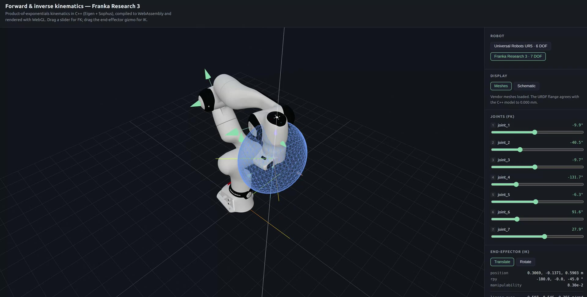

# modern-robotics-wasm — WebGL + WASM FK/IK

An interactive demo of **Product of Exponentials (PoE)** forward/inverse kinematics written in C++,
compiled to **WebAssembly**, and rendered with **WebGL (three.js)**.
It supports two robots — **UR5 (6 DOF)** and **Franka Research 3 (7 DOF)** — switchable on screen,
and renders the **actual meshes** from each manufacturer's official URDF
(it also works in a schematic mode without meshes).

- Move a **slider** → the joint values change and the C++ `forward()` computes the EE pose (**FK**).
- Drag the **axis gizmo attached to the EE** → the target pose goes into the C++ `inverse()` and the joint values are solved (**IK**).

The kinematics implement the space-frame PoE formulation with Eigen + Sophus. On top of FK and the
Jacobian, it also provides the link frames needed to draw the arm, manipulability ellipsoids, and a
joint-limit-respecting IK. The frontend is React + webpack + three-stdlib.

한국어 번역본은 [README.kor.md](README.kor.md)를 참고하세요.

---

## Demo

[](docs/demo.mp4)

**click the image to watch the video** ([docs/demo.mp4](docs/demo.mp4)).

---

## Quick start

```sh
# 1. Build the development Docker image (Eigen · Sophus · GoogleTest · Emscripten · Node 20)
docker/build.sh

# 2. Build WASM and run the frontend inside the container
docker/run.sh scripts/dev.sh
```

Open <http://localhost:3000> in a browser.

`scripts/dev.sh` builds the WASM, runs `npm install` if `web/node_modules` is missing,
and starts the webpack dev server.

If you use VS Code, **Reopen in Container** with `.devcontainer/devcontainer.json` works the same way.

---

## Controls

| Control | Action |
| --- | --- |
| Drag a joint slider | **FK** — joint values → EE pose |
| Drag an arrow on the EE gizmo | **IK** — target position → joint values (Translate mode) |
| Drag a ring on the EE gizmo | **IK** — target orientation → joint values (Rotate mode) |
| Drag empty space / scroll wheel | Orbit / zoom the camera |
| Presets buttons | Jump to representative poses (including singular ones) |
| Show joint rotation axes | Toggle each joint's rotation axis (cyan arrows) |
| Manipulability ellipsoid | Ellipsoid drawn at the EE — Linear / Angular / Off |
| Collision capsules | Toggle the capsule collision body — turns red on any collision, tightest clearance shown in mm |
| Motion planning | Add/drag sphere obstacles, store a goal pose, plan with RRT-Connect, replay the result |
| Dynamics | Hand the arm to Newton–Euler physics: Passive / Gravity comp / PD hold / Track plan, plus a Nudge disturbance |
| IK solver buttons | Switch between Box QP and DLS + clamp — compare while dragging |
| Robot buttons | Switch between UR5 (6 DOF) and FR3 (7 DOF) |
| Display buttons | Switch between Meshes (real manufacturer meshes) and Schematic (link/joint diagram) |

The readout at the bottom right shows the EE position/RPY, the **manipulability**
(close to 0 means a singularity), and — while dragging — the IK's convergence status,
iteration count, and residual in real time.

---

## Directory layout

```
cpp/
  include/robotics/
    core/types.hpp              # Scalar · Pose · Twist · JointVector · JointLimit
    core/screw.hpp              # ScrewAxis (revolute / prismatic factories)
    core/dh.hpp                 # Modified (Craig) DH row → Pose
    kinematics/serial_chain.hpp # SerialChain<Dof> — FK · link frames · joint axes · Jacobian
    kinematics/manipulability.hpp
    collision/shapes.hpp        # Sphere · Capsule + analytic signed distances
    collision/robot_geometry.hpp # link-attached capsules, derived from the chain's frames
    collision/world.hpp         # obstacle world + self/obstacle contact queries
    planning/rrt_connect.hpp    # RRT-Connect + shortcut smoothing (joint space)
    planning/trajectory_optimizer.hpp # CHOMP-style smoothing on top of box_qp
    dynamics/inertia.hpp        # capsule-derived link inertias (one body source)
    dynamics/newton_euler.hpp   # RNEA: inverse/forward dynamics · M(q) · energies
    dynamics/simulation.hpp     # symplectic Euler sim + torque controllers
    solvers/box_qp.hpp          # box-constrained QP (projected Gauss–Seidel)
    solvers/inverse_kinematics.hpp
    models/ur5.hpp              # UR5 (6 DOF)
    models/fr3.hpp              # FR3 (7 DOF), screw axes derived from a DH table
    robot.hpp                   # Robot interface + registry
  src/robot.cpp                 # ChainRobot<Dof> adapter · catalog
  apps/demo/main.cpp            # Native example binary (for gdb debugging)
  bindings/wasm/bindings.cpp    # embind — Robot + createRobot() exposed to JS
  tests/                        # GoogleTest suite (chain · models · collision · solvers · registry)
web/
  src/kinematics/               # WASM loader + TypeScript types + URDF asset mapping
  src/components/               # RobotViewer · JointSliders · PoseReadout
  e2e/viewer.spec.ts            # Playwright browser tests
  public/wasm/                  # Build outputs (gitignored)
  public/robots/                # Manufacturer URDFs + meshes (fetch_meshes.sh, gitignored)
docker/                         # Dockerfile · build.sh · run.sh · docker-compose.yml
scripts/                        # build_native · build_wasm · test · fetch_meshes · dev · ci · e2e
.github/workflows/ci.yaml       # CI
```

---

## Code conventions

The codebase targets C++20; `.clang-format` and `.clang-tidy` enforce the rules mechanically
(`scripts/ci.sh` includes the format check).

| Target | Rule | Example |
| --- | --- | --- |
| Types · aliases | `CamelCase` | `SerialChain`, `JointLimit`, `Pose` |
| Functions · methods | `snake_case` | `space_jacobian()`, `clamp_to_limits()` |
| Variables · parameters | `snake_case` | `joint_angles`, `error_twist` |
| Private members | `snake_case_` | `joints_`, `end_effector_home_` |
| Constants · constexpr | `kCamelCase` | `kPi`, `kFr3DhTable` |
| Namespaces | `snake_case` | `robotics::models`, `robotics::ik` |
| Files | `snake_case.hpp` | `serial_chain.hpp` |

---

## Scripts

All of these run inside the container (`docker/run.sh <script>`).

| Script | Description |
| --- | --- |
| `scripts/build_native.sh` | Native C++ build (example + tests) |
| `scripts/test.sh` | Build, then run GoogleTest (`ctest`) |
| `scripts/build_wasm.sh` | Emscripten build → copied to `web/public/wasm/` |
| `scripts/smoke_wasm.cjs` | Verify the WASM bindings in Node (no browser) |
| `scripts/fetch_meshes.sh` | Download manufacturer URDFs/meshes → `web/public/robots/` (~32 MB) |
| `scripts/dev.sh` | Build WASM + download meshes (if needed) + run the dev server |
| `scripts/ci.sh` | Full check suite run by CI (format · C++ tests · WASM · typecheck · build) |
| `scripts/e2e.sh` | Playwright browser tests |

```sh
docker/run.sh scripts/ci.sh            # full check suite (same as CI)
docker/run.sh scripts/test.sh          # run the C++ unit tests
docker/run.sh node scripts/smoke_wasm.cjs
```

---

## Kinematics notes

The space-frame PoE formulation is used throughout.

$$T(\theta) = e^{[\mathcal{S}_0]\theta_0} \cdots e^{[\mathcal{S}_{n-1}]\theta_{n-1}} M$$

- Screw axes $\mathcal{S}_i$ are given in the textbook (Modern Robotics) `[w, v]` order and
  converted internally to Sophus's `[v, w]` order (`toSophusTwist`).
- $M$ is the EE pose when all joint angles are zero.
- The **Jacobian** is the space Jacobian, $J_i = \mathrm{Ad}_{(e^{[\mathcal{S}_0]\theta_0}\cdots e^{[\mathcal{S}_{i-1}]\theta_{i-1}})} \mathcal{S}_i$.

### IK — two step strategies

IK is an iterative method, and in this demo it is called every frame while a human drags the gizmo.
During a drag, the target routinely passes through singularities or leaves the workspace — that is
**normal and frequent** — so three safeguards are always on: `damping` (prevents divergence near
singularities), `max_step` (prevents jumps between frames), and `max_iterations` (guarantees
termination on unreachable targets).

Two ways of handling joint limits are provided and can be switched in the UI
(`ik::Options::method`, default `BoxQp`). **Both minimize the same quadratic model.**

$$\min_{\Delta\theta}\ \tfrac12\lVert J\,\Delta\theta - e \rVert^2 + \tfrac12\lambda^2\lVert \Delta\theta \rVert^2,
\qquad e = \log(T_d T^{-1})$$

**`DampedLeastSquares`** — solve **as if there were no limits**, then clip afterwards.

$$\Delta\theta = (J^\top J + \lambda^2 I)^{-1} J^\top e,
\qquad \theta \leftarrow \mathrm{clip}(\theta + \Delta\theta,\ \theta_{\min},\ \theta_{\max})$$

**`BoxQp`** — put the limits into the step as **constraints** (box-constrained QP).

$$\text{s.t.}\quad \max(\theta_{\min}-\theta,\ -\delta) \le \Delta\theta \le \min(\theta_{\max}-\theta,\ +\delta)$$

The key difference is **redistribution**. When a joint hits its limit, clamping simply cuts that
component off — the remaining joints keep values that were computed under the assumption that the
clamped joint would move, so they never pick up the slack. In the QP, the KKT conditions force the
free joints to take over that share.
Geometrically, clamping is an **orthogonal projection** of the step onto the box, while the QP
projects in the $\lVert\cdot\rVert_H$ (**H-metric**). Unless $H = J^\top J + \lambda^2 I$ is
diagonal (i.e., unless the joints are decoupled), the two differ.

`max_step` in the QP is likewise just a narrower box. The clamped method **shrinks the whole step**
when one component overflows, slowing down unrelated joints too, whereas the QP limits each joint
independently.

The QP is solved with a primal **projected Gauss–Seidel** (coordinate descent + interval projection)
(`solvers/box_qp.hpp`). Since $H$ is positive definite, the minimizer is unique and convergence is
guaranteed. The primal form builds no inverse and does no allocation, which suits code that runs on
every mouse move.

#### How different is it in practice?

Over 300 random reachable targets, with the box narrowed so the limits actually bind:

| | DLS + clamp | Box QP |
| --- | --- | --- |
| UR5 (6 DOF, symmetric box) | **258/300** (33 it) | 234/300 (39 it) |
| FR3 (7 DOF, asymmetric limits) | 128/300 (68 it) | **149/300** (62 it) |
| Cost per solve | ~10 µs | ~30 µs |

- **Taken one step at a time, the QP never loses** — it is the minimizer over the feasible region.
  A test (`QpStepIsNeverWorseThanClampedDampedLeastSquares`) verifies this via the model cost.
- **On the FR3, where the limits bind hard, the QP is clearly better** (+16 %, fewer iterations).
- **Conversely, on the UR5 with a generous box, clamping is slightly better.** The QP's step is
  greedy and deterministically enters the corners of the box, sometimes settling into a
  **constrained local minimum**, while clamping's "wrong" step can accidentally escape that point.
  (Observed example: on the narrow-limit UR5 the QP gets stuck at `posErr = 8.2 mm` — unchanged
  even at 3000 iterations, but escapes when damping is raised to 0.2.) This is a property of local
  methods, not an implementation bug.
- The cost is 3×, but the absolute value is 30 µs — over 500 solves per frame are possible, so it
  is irrelevant for interactive use.

The default is `BoxQp` because **it is better precisely when the limits actually matter**.
The UR5's real limits are $\pm 2\pi$ and almost never bind, so the two methods are effectively
identical there.

### Manipulability ellipsoid

The manipulability ellipsoid is the image of the joint-velocity unit ball
$\|\dot\theta\| \le 1$ under the Jacobian. The principal axes point along the left singular
vectors of $J$; the radii are the singular values.

One caveat: **the linear-velocity block of the space Jacobian gives the velocity of a point
attached to the origin, not the tool.** To draw the ellipsoid at the EE it must be shifted to
the tool point.

$$\dot p = v_s + \omega_s \times p = (J_v - [p]_\times J_\omega)\,\dot\theta$$

Angular velocity is the same at every point of a rigid body, so $J_\omega$ is used as is.
`manipulability_ellipsoids()` runs an SVD on each block and returns the principal axes
(guaranteed right-handed), the singular values, `volume` ($\sigma_1\sigma_2\sigma_3$), and
`isotropy` ($\sigma_{\min}/\sigma_{\max}$).

Press the Home preset and you can watch the **angular ellipsoid collapse exactly to a disc**
(`isotropy = 0`), because all six UR5 joint axes lie in the y–z plane there.
At the wrist singularity ($\theta_5 = 0$), on the other hand, the remaining four axes still span
three dimensions, so the angular block keeps its rank and the ellipsoid merely **flattens** —
distinct from the full 6D Jacobian losing rank.

### FR3 — deriving screw axes from a modified DH table

The UR5's screw axes are tabulated in the textbook, but Franka publishes its kinematics as
**modified (Craig) DH parameters**. Transcribing them by hand is error-prone, so the screw axes
are derived by walking the DH table once at the zero configuration.

Joint $i$ rotates about the $z$ axis of its own DH frame, so in the base frame

$$\mathcal{S}_i = \begin{bmatrix}\omega_i \\ -\omega_i \times q_i\end{bmatrix},\quad
\omega_i = z_i,\; q_i = o_i$$

Feed the resulting axes straight into `add_joint_axis()` and the rest of the code
(FK · IK · Jacobian · ellipsoids) works unchanged except for the DOF.

**Caveat — the FR3's zero configuration is outside its joint limits.**
Joint 4's upper limit is $-0.1518$ and joint 6's lower limit is $+0.5445$, so `q = 0` is
unreachable on the real hardware. The FR3's default configuration is therefore Franka's
**ready** pose $(0, -\pi/4, 0, -3\pi/4, 0, \pi/2, \pi/4)$, and a test enforces that every
preset stays within the limits.

One more thing: the ready-pose position $(0.307, 0, 0.487)$ in Franka's documentation is for the
**gripper (TCP)**. This project uses the **flange** as the EE to match the UR5, which gives
$z = 0.5903$; multiplying by the Franka Hand's `F_T_EE` ($0.1034$ along z, $-45°$ about z)
reproduces the documented value exactly — verified by a test.

### Rendering the manufacturer meshes

`scripts/fetch_meshes.sh` downloads the URDFs and visual meshes from each manufacturer's official
description repository into `web/public/robots/`. ROS2 xacro is handled with an
`ament_index_python` stub, so the conversion to plain URDF works **without a ROS installation**.

**No extra offsets are needed** to align the meshes. The URDF chain and this project's PoE model
describe the same robot, so feeding the joint values solved by C++ straight into the URDF places
the rendered flange exactly at the `forward()` position. The viewer actually measures this claim
right after loading and shows it in the Display panel — **under 0.001 mm** for both robots.

> **A note on UR5 link lengths.** *Modern Robotics* prints the UR5 dimensions rounded to three
> decimal places (0.109 / 0.082 / 0.392 / 0.089 / 0.095). Using those values misaligns the meshes
> by **0.75 mm**, so this project uses the full-precision values from the manufacturer's
> `default_kinematics.yaml`. Textbook Example 4.5 still matches at the three-digit precision the
> book actually prints.

The meshes are third-party assets, so they are downloaded rather than committed. All licenses are
permissive.

| Robot | Source | License |
| --- | --- | --- |
| UR5 | [Universal_Robots_ROS2_Description](https://github.com/UniversalRobots/Universal_Robots_ROS2_Description) | BSD-3-Clause |
| FR3 | [franka_description](https://github.com/frankaemika/franka_description) | Apache-2.0 |

At download time, each repository's `LICENSE` and commit hash are recorded alongside the assets in
`web/public/robots/ATTRIBUTION.md`.
The FR3 is generated with `hand:=false` so that the **flange** is the EE.

### Link frames for rendering

FK/IK only need the EE pose, but drawing the arm requires the intermediate joint positions.
So each model stores the home pose of the frame carried by each joint (`JointSpec::link_home`),
and `SerialChain::link_poses()` returns the current poses.

$$T_i(\theta) = e^{[\mathcal{S}_0]\theta_0} \cdots e^{[\mathcal{S}_i]\theta_i} M_i$$

`linkFrames()` returns `DOF + 1` poses in total — `DOF` joint frames plus the EE — along with
each joint's current rotation axis. Every coordinate in the viewer comes from here, so
**there is no kinematics computation on the JavaScript side at all.**

---

## Motion planning

### Collision model

Each link is a **capsule** spanning consecutive joint-frame origins — the same skeleton the
schematic mode draws — with radii padded to enclose the vendor meshes (`ur5_collision()`,
`fr3_collision()`). Capsule–capsule and capsule–sphere distances are analytic, and every query
returns a **signed distance** together with a witness point and normal: sampling planners consume
the sign, and an optimisation-based planner can later consume the gradient. Pairs whose gap is
fixed by construction (the UR5 wrist offsets, the FR3 elbow and wrist offsets) are excluded from
self-collision checks, the way an SRDF disables pairs that touch by design.

### RRT-Connect + shortcut (`planning/rrt_connect.hpp`)

`plan_rrt_connect()` grows two trees in joint space, one from the start and one from the goal
(Kuffner & LaValle, 2000). Each iteration extends one tree a single `step` toward a uniform sample,
then the other tree extends **greedily** toward the new vertex until it reaches it or is trapped;
the roles swap every iteration. Every edge is validated by sampling it each `resolution` radians
against the capsule model with `margin` of required clearance.

The raw path is jagged — the price of sampling — so a **shortcut pass** follows: random waypoint
pairs are joined by a straight segment whenever that segment is collision-free. The viewer draws
both end-effector traces (dim: raw, bright: shortcut) so the difference stays visible.

Design notes:

- **Deterministic.** The sampler draws 24 explicit mantissa bits from a xorshift generator instead
  of `std::uniform_real_distribution` (whose output is implementation-defined), so the same seed
  reproduces the same path natively and under WebAssembly; the tests rely on that.
- **Failure is typed.** `Status::{kStartInvalid, kGoalInvalid, kNotFound}` lets the UI say whether
  to move the arm, re-set the goal, or relax the obstacles, instead of a bare "failed".
- **Test obstacles are probed, not guessed.** The unit-test spheres were placed by numerically
  scanning candidate positions so both endpoints keep real clearance while the straight-line sweep
  penetrates deeply — the planner must detour to pass.

### Optimisation-based smoothing (`planning/trajectory_optimizer.hpp`)

The shortcut path is feasible but still a polyline with kinks and no clearance buffer, so a
CHOMP-style pass follows. The path is densified, then each interior waypoint is repeatedly
re-solved with its neighbours held fixed (coordinate descent over waypoints), minimising

$$w_s\big(\lVert q - q_{prev}\rVert^2 + \lVert q_{next} - q\rVert^2\big)
+ w_o\,\max(0,\ d_{safe} - d(q))^2 + \lambda\lVert\Delta q\rVert^2$$

subject to the joint limits and a per-sweep trust region. That is exactly the quadratic-plus-box
shape of the IK step, so **`solve_box_qp` is reused verbatim** as the subproblem solver. The
obstacle term is linearised through the collision witness: the signed distance grows along
`normal` at the witness `point`, and a positional Jacobian of that point (`point_jacobian`) maps
the direction into joint space — the gradient the collision module was designed to provide.

The behaviour that falls out: the stretch term pulls the path straight until the obstacle term
pushes back, so the result trades *excess* clearance for length and settles just below
`safe_distance` — shorter than the shortcut where the shortcut was wasteful, curved where the
shortcut had corners. A local method guarantees nothing, so the output is re-validated edge by
edge; if that fails the densified shortcut (feasible by construction) is returned instead, and
the UI says so.

In the viewer: **Add obstacle** drops a draggable sphere, **Set goal = current** stores the goal,
**Plan path** runs the planner from the current pose, and three end-effector traces appear —
raw RRT (dim grey), shortcut (yellow), optimized (bright cyan). The optimized path is the one
that replays.

---

## Dynamics and control

### One body, three uses

The dynamics does not import a URDF's inertia tags. Each link's **published mass**
(`ur_description` for the UR5; the identified Panda set from `franka_description` for the FR3) is
spread uniformly over the **same capsule the collision model uses**, giving an analytic COM and
tensor (`dynamics/inertia.hpp`). Geometry, collision and dynamics therefore describe one body —
approximate, but self-consistent, and every constant is derivable from the code itself.

### Newton–Euler (`dynamics/newton_euler.hpp`)

The recursive Newton–Euler algorithm of Modern Robotics chapter 8, run in each link's own frame:
twists and accelerations propagate outward, wrenches propagate back, and gravity enters as the
standard fictitious base acceleration. Everything else is built from it:

- `gravity_torque` — RNEA with zero motion;
- `bias_torque` — RNEA with zero acceleration (Coriolis + gravity);
- `mass_matrix` — one RNEA per unit acceleration column;
- `forward_dynamics` — `M(q) qdd = τ - bias`, solved by LDLT.

Correctness is pinned by tests that cross independent code paths: the gravity torque must equal
the finite-difference gradient of the potential energy, `0.5 qd^T M qd` must match the energy
summed link by link from finite-difference twists, forward∘inverse must be the identity, and the
undamped passive arm must conserve energy over 500 steps.

### Simulation and controllers (`dynamics/simulation.hpp`)

Semi-implicit (symplectic) Euler at 1 ms substeps — the reason the passive arm swings indefinitely
instead of gaining energy — with joint limits as inelastic stops. Four controllers, in increasing
order of model use:

| Controller | Law | What it demonstrates |
| --- | --- | --- |
| Passive | `τ = 0` | The plant itself: falling, swinging, friction |
| Gravity comp | `τ = g(q)` | Exact cancellation: the arm floats anywhere |
| PD hold | `τ = g(q) + M(q)(Kp e − Kd q̇)` | Mass-shaped gains: one gain pair fits every joint |
| Track plan | `τ = M(q)(q̈_ref + Kp e + Kd ė) + C q̇ + g(q)` | Computed torque: the plan replays under physics |

The PD gains are shaped by `M(q)` deliberately: a fixed scalar gain that behaves on the 8 kg
upper arm exceeds the explicit integrator's stability bound on the nearly massless wrist — the
first unshaped implementation blew up in exactly that way, and the test suite now encodes the
lesson. Computed torque differs from PD by feeding the reference motion forward and cancelling
Coriolis forces, which is what turns "arrives eventually" into "tracks".

---

## JS ↔ WASM interface

The embind bindings live in `cpp/wasm/bindings.cpp`; the TypeScript declarations are in
`web/src/kinematics/types.ts` (embind performs no compile-time checking, so the two must be
edited together).

```ts
const module = await loadKinematics();

module.availableRobots();     // [{ id: "ur5", label, dof: 6 }, { id: "fr3", ..., dof: 7 }]
const arm = module.createRobot("fr3");   // null for an unknown id

arm.dof();                    // 7
arm.label();                  // "Franka Research 3"
arm.jointLimits();            // [{ name, lower, upper }, ...]
arm.defaultConfiguration();   // starting pose guaranteed to be within limits
arm.presets();                // [{ label, angles }, ...] — presets are owned by C++ too

// FK
const pose = arm.forward(angles);
// pose.position [x,y,z] · pose.quaternion [x,y,z,w] · pose.matrix (16, column-major)

// Frames for rendering
const { frames, axes } = arm.linkFrames(angles);

// IK
const result = arm.inverse(currentAngles, targetPosition, targetQuaternion, {
  maxIterations: 60,
  damping: 0.02,
  maxStep: 0.25,
});
// result.angles · converged · iterations · positionError · orientationError

arm.manipulability(angles);   // close to 0 means a singularity
arm.jacobian(angles);         // 6 x DOF, row-major, [v; w] order

// Manipulability ellipsoids — apply the quaternion to a unit sphere and scale by radii
const { linear, angular } = arm.manipulabilityEllipsoids(angles);
// linear.quaternion [x,y,z,w] · linear.radii [a,b,c] · linear.volume · linear.isotropy

// Collision + motion planning
const world = { spheres: [{ center: [0.5, 0, 0.4], radius: 0.12 }] };
arm.collisionBody(angles);            // posed capsules + tightest self contact
arm.nearestContact(angles, world);    // signed clearance, obstacles and self both
const plan = arm.plan(startAngles, goalAngles, world, { seed: 7 });
// plan.status ("success" | "start_invalid" | "goal_invalid" | "not_found")
// plan.path · rawPath · optimizedPath · optimizedFeasible · iterations · nodes
// plan.pathLength · rawLength · optimizedLength

arm.delete();                 // embind objects are not garbage collected
```

Poses are returned both as `position`/`quaternion` and as a column-major `matrix`, so they can go
straight into `THREE.Matrix4.fromArray()`.

---

## Verification

```
$ docker/run.sh scripts/test.sh
100% tests passed, 0 tests failed out of 48
```

The tests are split across four files.

| File | Covers |
| --- | --- |
| `tests/test_serial_chain.cpp` | Screw axes, FK, link frames, joint axes, Jacobian (checked against numerical differentiation), limits, manipulability ellipsoids |
| `tests/test_models.cpp` | UR5 (textbook Example 4.5 · disc collapse at home · wrist singularity), FR3 (DH chain · Franka ready pose · limits · Jacobian) |
| `tests/test_solvers.cpp` | Box QP (matches unconstrained solution · KKT), IK (round trip · termination · limits · redundancy · **QP step never worse than clamping**) |
| `tests/test_robot_registry.cpp` | Registry creation, unknown ids, dynamic interface == template, both paths respect limits |

Tests that pin down specific values:

- **Modern Robotics Example 4.5** — $\theta = (0, -\pi/2, 0, 0, \pi/2, 0)$ → $p = (0.095, 0.109, 0.988)$
- **Franka ready pose** — flange × Franka Hand `F_T_EE` == the documented $(0.307, 0, 0.487)$
- **Analytic Jacobian == numerical differentiation** (both robots)
- **The linear ellipsoid actually contains tool velocities sampled via numerical differentiation**
- **The QP step's model cost ≤ the clamped DLS step's** (strictly smaller when constrained)

Browser behavior is covered by the Playwright tests in `web/e2e/viewer.spec.ts` —
WASM loading · WebGL context · reproducing the textbook values · slider FK · DOF/limits on robot
switch · ellipsoid collapse at singularities · IK method switching · **HiDPI layout overflow**.
They pass in schematic mode without meshes, so they don't depend on third-party downloads.

The WASM bindings are verified again from Node with `scripts/smoke_wasm.cjs`, covering the same items.

---

## CI

`.github/workflows/ci.yaml` runs two jobs. **CI is kept thin** — it just builds the development
Docker image and calls the scripts, so CI can be reproduced locally as-is with
`docker/run.sh scripts/ci.sh`.

| Job | Contents |
| --- | --- |
| `checks` | `scripts/ci.sh` — clang-format · the C++ tests · WASM build + binding smoke test · TS typecheck · production build |
| `e2e` | `scripts/e2e.sh` — the Playwright browser tests |

- The image is cached with the GitHub Actions layer cache (`type=gha`).
  The full cost is only paid when the Dockerfile changes.
- `e2e` is a separate job because it needs a browser and is slow.
  **Meshes are deliberately not downloaded** — so that a third-party repository outage cannot break
  the build, and because the viewer's schematic-mode fallback path is itself under test.
- Where this CI earns its keep is the **embind boundary**. There is no compile-time checking
  between `bindings.cpp` and `web/src/kinematics/types.ts`, so without `scripts/smoke_wasm.cjs`
  they can drift apart silently.

## Adding a new robot

The kinematics keep fixed-size operations via the `Kinematics<DOF>` template, and `RobotBase`
provides a runtime interface with the DOF erased. As a result, neither the bindings nor the
frontend need per-robot changes.

1. Create a model header modeled after `models/ur5.hpp` (axes and points on them specified
   directly) or `models/fr3.hpp` (derived from a DH table), and write one factory returning a
   `SerialChain<Dof>`.
2. Register the id, label, default configuration, and presets in `robot_catalog()` and
   `make_robot()` in `src/robot.cpp`. `ChainRobot<Dof>` is a template, so the DOF adjusts
   automatically.

That's it. `bindings.cpp`, the TypeScript, and the UI all read the registry, so there is nothing
else to modify, and the `RobotRegistry` tests automatically check that the new robot's presets and
default configuration stay within its limits.
To attach meshes as well, add the URDF path and joint names to `web/src/kinematics/robotAssets.ts`.

---

## References

- Lynch & Park, *Modern Robotics*, Ch. 4 (Forward Kinematics) · Ch. 5 (Velocity Kinematics, manipulability) · Ch. 6 (Inverse Kinematics)
- [Sophus](https://github.com/strasdat/Sophus) — SE(3) / SO(3) Lie group operations
- [Emscripten](https://emscripten.org/docs/porting/connecting_cpp_and_javascript/embind.html) — embind bindings
